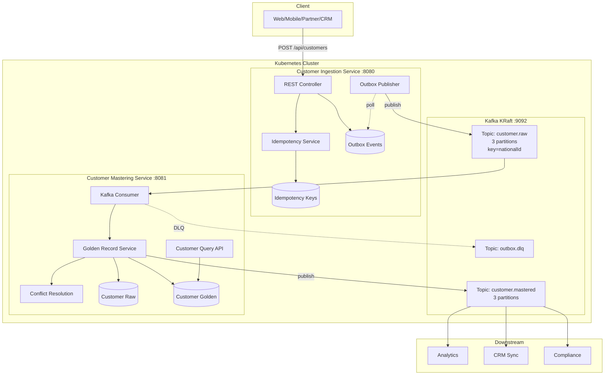
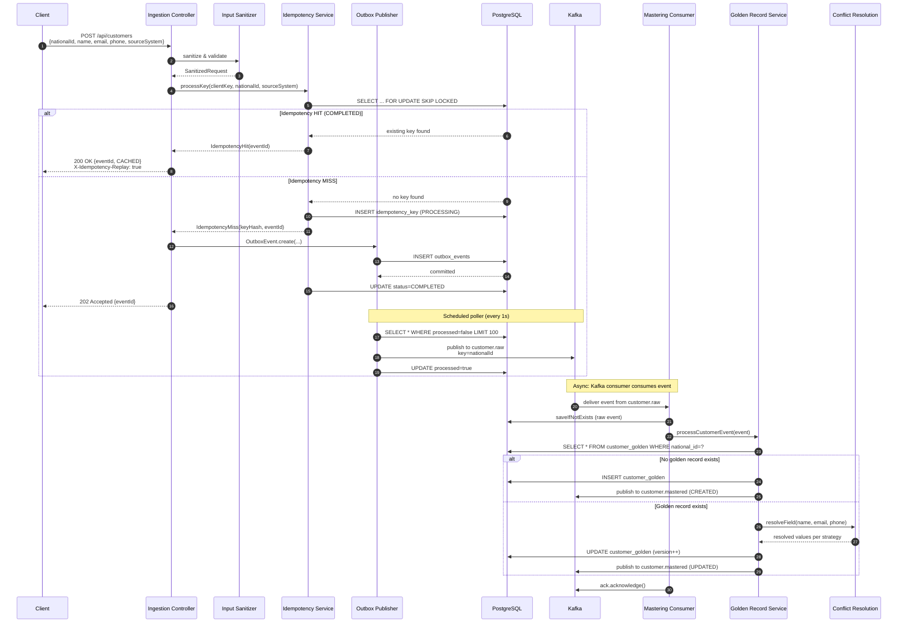
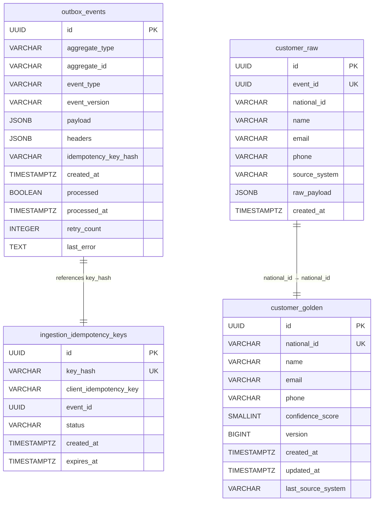

# DESIGN-PLAN: Customer Master Data Management (MDM)

> **Version:** 1.0 | **Last Updated:** 2026-04-13 | **Audience:** Technical Managers, Architects, Engineers

---

## 1. 🧾 STATEMENT

### The Problem

In fintech and enterprise environments, customer data arrives from multiple disparate sources — web portals, mobile apps, partner systems, banking platforms, and government registries. Each source maintains its own representation of the same customer, leading to three critical business challenges:

1. **Duplicate Records** — The same customer exists multiple times across systems with slight variations (typos, different formats, outdated information).
2. **Inconsistent Data** — A customer's name, email, or phone may differ between systems, making it impossible to trust any single source.
3. **No Single Customer View** — Business teams (support, compliance, analytics) cannot get a unified, authoritative view of a customer without manually reconciling data across systems.

### What This System Does

This **Master Data Management (MDM) system** solves these problems by:

- Accepting customer data from any source system via a REST API
- Deduplicating records using **nationalId** as the canonical, unambiguous customer identifier
- Maintaining a **Golden Record** — a single, authoritative source of truth for each customer
- Publishing all changes via an event stream (Kafka) so downstream systems stay synchronized

The result: every team and system in the organization can rely on one consistent, trusted customer record.

### Key Business Value

| Stakeholder | Benefit |
|-------------|---------|
| **Support Teams** | Single view of customer — no more juggling multiple records |
| **Compliance** | Immutable audit trail of every data change |
| **Engineering** | Event-driven architecture allows downstream systems to sync without tight coupling |
| **Business Intelligence** | Reliable deduplicated data for analytics and reporting |

---

## 2. ✅ FUNCTIONAL REQUIREMENTS

| ID | Requirement | Description |
|----|-------------|-------------|
| FR-01 | **Customer Ingestion** | Accept customer records via REST API (`POST /api/customers`) with validated fields (nationalId, name, email, phone, sourceSystem) |
| FR-02 | **Idempotent Submission** | Prevent duplicate processing via dual-key idempotency: client-provided `X-Idempotency-Key` header OR deterministic SHA-256 key derived from nationalId + sourceSystem |
| FR-03 | **Event-Driven Processing** | Publish ingested records to Kafka topic `customer.raw` for async downstream processing |
| FR-04 | **Golden Record Management** | Create or update a unified customer record (golden record) in PostgreSQL based on nationalId exact-match deduplication |
| FR-05 | **Conflict Resolution** | Resolve field-level conflicts using configurable strategies: LATEST_UPDATE, TRUSTED_SOURCE, MOST_FREQUENT, NON_NULL, MERGE |
| FR-06 | **Mastered Event Publishing** | Publish golden record changes to Kafka topic `customer.mastered` for downstream system synchronization |
| FR-07 | **Customer Query API** | Provide read endpoints: list, get by ID, get by nationalId, search by name, existence check, and count |
| FR-08 | **Transactional Outbox** | Guarantee reliable event publishing using the transactional outbox pattern (atomic DB write + async Kafka publish) |
| FR-09 | **Dead Letter Queue (DLQ)** | Route unprocessable messages to DLQ topics after retry exhaustion for manual investigation |
| FR-10 | **Audit Trail** | Store every raw event immutably in `customer_raw` table for compliance and replay capability |
| FR-11 | **OAuth2 Authentication** | Secure all API endpoints with JWT-based OAuth2 Resource Server (roles: CUSTOMER_WRITE, CUSTOMER_READ, ADMIN) |

---

## 3. ⚙️ NON-FUNCTIONAL REQUIREMENTS

| Category | Requirement | Details |
|----------|-------------|---------|
| **Scalability** | Horizontal scaling | Both microservices are stateless and can scale horizontally via Kubernetes HPA. Kafka partitions (currently 3) can be increased to support higher throughput |
| **Performance** | Low-latency ingestion | REST API returns 202 Accepted immediately (async processing). SLO: 99% of event processing < 100ms; deduplication lookup < 10ms |
| **Availability** | High availability | Each service runs with 2+ replicas in Kubernetes. Kafka KRaft mode eliminates Zookeeper single point of failure |
| **Consistency** | Eventual consistency | REST ingestion is synchronous; golden record update is async via Kafka. Per-customer ordering guaranteed via Kafka partition key = nationalId |
| **Security** | OAuth2 + JWT + PII masking | All API endpoints require valid JWT. Sensitive data (nationalId, email) is masked in logs. Database credentials managed via Kubernetes Secrets |
| **Reliability** | At-least-once delivery | Kafka consumer acknowledges after processing. Idempotent consumer pattern prevents duplicate golden record updates. Transactional outbox prevents lost events |
| **Observability** | Prometheus metrics + health checks | Exposes `/actuator/prometheus` for scraping. Health indicators for database, Kafka, and processing error rate. SLI/SLO tracking with burn-rate calculations |
| **Fault Tolerance** | DLQ + retry logic | Failed events retried up to 3 times with exponential backoff (1s → 2s → 4s, max 10s) before routing to DLQ. Idempotency failures handled with separate transaction (`REQUIRES_NEW`) to prevent permanent lockouts |

### SLO Targets

| SLI | Target | Measurement |
|-----|--------|-------------|
| Event Processing Latency | 99% < 100ms | `mdm.event_processing_latency_seconds` |
| Deduplication Lookup Latency | 99% < 10ms | `mdm.deduplication_lookup_latency_seconds` |
| Error Rate | < 0.1% | `mdm.processing_errors_total / mdm.events_processed_total` |
| Duplicate Rate | Monitored | `mdm.duplicates_detected_total / mdm.events_processed_total` |

---

## 4. 🏗️ SYSTEM ARCHITECTURE

### Layered Flow

```
Client (Web/Mobile/Partner)
    │
    ▼
┌─────────────────────────────────────────────────────────────┐
│                  API Gateway / Load Balancer                │
└─────────────────────────────────────────────────────────────┘
    │
    ▼
┌─────────────────────────────────────────────────────────────┐
│            Customer Ingestion Service (Command Side)        │
│  ┌──────────────────────────────────────────────────────┐   │
│  │  Controller Layer                                     │   │
│  │  - CustomerIngestionController (POST /api/customers)  │   │
│  │  - OutboxManagementController (Admin endpoints)       │   │
│  └──────────────────────────────────────────────────────┘   │
│                          │                                   │
│                          ▼                                   │
│  ┌──────────────────────────────────────────────────────┐   │
│  │  Service Layer                                        │   │
│  │  - IngestionUseCaseService  (orchestrator)            │   │
│  │  - IngestionInputSanitizer  (validation/normalization)│   │
│  │  - IdempotencyService       (dual-key dedup)          │   │
│  │  - IngestionEventBuilder    (event construction)      │   │
│  │  - OutboxPublisher          (scheduled Kafka publish) │   │
│  └──────────────────────────────────────────────────────┘   │
│                          │                                   │
│                          ▼                                   │
│  ┌──────────────────────────────────────────────────────┐   │
│  │  Repository/DAO Layer                                 │   │
│  │  - IdempotencyKeyRepository  (pessimistic locking)    │   │
│  │  - OutboxEventRepository     (poll unprocessed)       │   │
│  └──────────────────────────────────────────────────────┘   │
│                          │                                   │
│                          ▼                                   │
│  ┌──────────────────────────────────────────────────────┐   │
│  │  Database (PostgreSQL)                                │   │
│  │  - ingestion_idempotency_keys                         │   │
│  │  - outbox_events                                      │   │
│  └──────────────────────────────────────────────────────┘   │
└─────────────────────────────────────────────────────────────┘
    │
    │  Kafka: customer.raw (partition key = nationalId)
    ▼
┌─────────────────────────────────────────────────────────────┐
│            Customer Mastering Service (Query Side)          │
│  ┌──────────────────────────────────────────────────────┐   │
│  │  Kafka Consumer Layer                                 │   │
│  │  - CustomerRawEventListener (consumer from raw)       │   │
│  └──────────────────────────────────────────────────────┘   │
│                          │                                   │
│                          ▼                                   │
│  ┌──────────────────────────────────────────────────────┐   │
│  │  Service Layer                                        │   │
│  │  - GoldenRecordService    (dedup + merge logic)       │   │
│  │  - ConflictResolutionService (per-field strategies)   │   │
│  │  - CustomerQueryService   (read queries)              │   │
│  │  - CustomerMasteredEventProducer (publish mastered)   │   │
│  │  - DlqProducer / DlqMonitoringService                 │   │
│  └──────────────────────────────────────────────────────┘   │
│                          │                                   │
│                          ▼                                   │
│  ┌──────────────────────────────────────────────────────┐   │
│  │  Repository/DAO Layer                                 │   │
│  │  - CustomerGoldenRepository  (CRUD golden records)    │   │
│  │  - CustomerRawRepository     (store raw events)       │   │
│  └──────────────────────────────────────────────────────┘   │
│                          │                                   │
│                          ▼                                   │
│  ┌──────────────────────────────────────────────────────┐   │
│  │  Database (PostgreSQL)                                │   │
│  │  - customer_raw        (immutable audit trail)        │   │
│  │  - customer_golden     (single source of truth)       │   │
│  └──────────────────────────────────────────────────────┘   │
│                          │                                   │
│                          ▼                                   │
│  Kafka: customer.mastered (downstream sync)                 │
└─────────────────────────────────────────────────────────────┘
```

### Component Responsibilities

| Layer | Component | Responsibility |
|-------|-----------|----------------|
| **Controller** | `CustomerIngestionController` | Accept HTTP requests, validate auth, return 202/200/409 |
| **Controller** | `CustomerQueryController` | Serve read queries (list, search, by-ID, by-nationalId) |
| **Service** | `IngestionUseCaseService` | Orchestrate: sanitize → idempotency → build event → write to outbox |
| **Service** | `IdempotencyService` | Resolve dual-key idempotency with pessimistic locking (`FOR UPDATE SKIP LOCKED`) |
| **Service** | `OutboxPublisher` | Scheduled poller: fetch unprocessed outbox events → publish to Kafka → mark processed |
| **Service** | `GoldenRecordService` | Lookup by nationalId → create new or merge existing golden record |
| **Service** | `ConflictResolutionService` | Apply per-field resolution strategy (LATEST_UPDATE, TRUSTED_SOURCE, MERGE, etc.) |
| **Repository** | `IdempotencyKeyRepository` | Atomic upsert (`ON CONFLICT DO NOTHING`), pessimistic locks |
| **Repository** | `CustomerGoldenRepository` | `findByNationalId` (unique constraint → O(1) lookup) |
| **Infrastructure** | Kafka (KRaft) | Event backbone: `customer.raw`, `customer.mastered`, `outbox.dlq` |
| **Infrastructure** | PostgreSQL | Persistent storage with Flyway-manated schema |

---

## 5. 🗺️ ARCHITECTURE DIAGRAM

### Component Diagram



### Sequence Diagram: Request Lifecycle



---

## 6. 🧩 DATABASE DESIGN (ER Diagram)



### Relationships

| Parent Table | Child Table | Relationship | Key |
|-------------|-------------|--------------|-----|
| `ingestion_idempotency_keys` | `outbox_events` | 1:1 (via `idempotency_key_hash`) | `key_hash` |
| `customer_golden` | `customer_raw` | 1:N (one golden, many raw events) | `national_id` |

---

## 7. 🗄️ SQL DDL (Production Ready)

### Ingestion Service Schema

```sql
-- Idempotency keys table (dual-key strategy)
CREATE TABLE ingestion_idempotency_keys (
    id                      UUID PRIMARY KEY DEFAULT gen_random_uuid(),
    key_hash                VARCHAR(64) NOT NULL UNIQUE,     -- SHA-256 hash
    client_idempotency_key  VARCHAR(255),                     -- Optional client-provided key
    event_id                UUID NOT NULL,
    status                  VARCHAR(20) NOT NULL DEFAULT 'COMPLETED',
    response_body           JSONB,
    created_at              TIMESTAMPTZ NOT NULL DEFAULT NOW(),
    expires_at              TIMESTAMPTZ NOT NULL DEFAULT (NOW() + INTERVAL '24 hours')
);

CREATE INDEX idx_idempotency_expires ON ingestion_idempotency_keys(expires_at);
CREATE INDEX idx_idempotency_client_key ON ingestion_idempotency_keys(client_idempotency_key)
    WHERE client_idempotency_key IS NOT NULL;

-- Transactional outbox table (reliable event publishing)
CREATE TABLE IF NOT EXISTS outbox_events (
    id                      UUID PRIMARY KEY DEFAULT gen_random_uuid(),
    aggregate_type          VARCHAR(50) NOT NULL,
    aggregate_id            VARCHAR(255) NOT NULL,
    event_type              VARCHAR(100) NOT NULL,
    event_version           VARCHAR(20) NOT NULL DEFAULT '1.0',
    payload                 JSONB NOT NULL,
    headers                 JSONB,
    idempotency_key_hash    VARCHAR(64),
    created_at              TIMESTAMPTZ NOT NULL DEFAULT NOW(),
    processed               BOOLEAN NOT NULL DEFAULT FALSE,
    processed_at            TIMESTAMPTZ,
    retry_count             INTEGER NOT NULL DEFAULT 0,
    last_error              TEXT
);

CREATE UNIQUE INDEX IF NOT EXISTS idx_outbox_events_unprocessed ON outbox_events(id) WHERE processed = FALSE;
CREATE INDEX IF NOT EXISTS idx_outbox_events_created ON outbox_events(created_at) WHERE processed = FALSE;
CREATE INDEX IF NOT EXISTS idx_outbox_events_retry ON outbox_events(retry_count, created_at) WHERE processed = FALSE;
CREATE INDEX IF NOT EXISTS idx_outbox_events_aggregate_type ON outbox_events(aggregate_type);
```

### Mastering Service Schema

```sql
-- Raw customer events (immutable audit trail)
CREATE TABLE IF NOT EXISTS customer_raw (
    id              UUID PRIMARY KEY DEFAULT gen_random_uuid(),
    event_id        UUID NOT NULL UNIQUE,
    national_id     VARCHAR(64) NOT NULL,
    name            VARCHAR(255),
    email           VARCHAR(255),
    phone           VARCHAR(64),
    source_system   VARCHAR(50) NOT NULL,
    raw_payload     JSONB NOT NULL,
    created_at      TIMESTAMPTZ NOT NULL DEFAULT NOW()
);

CREATE INDEX IF NOT EXISTS idx_customer_raw_national_id ON customer_raw(national_id);
CREATE INDEX IF NOT EXISTS idx_customer_raw_event_id ON customer_raw(event_id);
CREATE INDEX IF NOT EXISTS idx_customer_raw_created ON customer_raw(created_at);

-- Golden record (single source of truth)
CREATE TABLE IF NOT EXISTS customer_golden (
    id                  UUID PRIMARY KEY DEFAULT gen_random_uuid(),
    national_id         VARCHAR(64) NOT NULL UNIQUE,
    name                VARCHAR(255),
    email               VARCHAR(255),
    phone               VARCHAR(64),
    confidence_score    SMALLINT NOT NULL DEFAULT 100,
    version             BIGINT NOT NULL DEFAULT 1,
    created_at          TIMESTAMPTZ NOT NULL DEFAULT NOW(),
    updated_at          TIMESTAMPTZ NOT NULL DEFAULT NOW(),
    last_source_system  VARCHAR(50)
);

CREATE INDEX IF NOT EXISTS idx_customer_golden_national_id ON customer_golden(national_id);
CREATE INDEX IF NOT EXISTS idx_customer_golden_updated ON customer_golden(updated_at);
```

---

## 8. 🔄 KEY FLOWS

### 8.1 Request Lifecycle (Ingestion Flow)

```
1. Client submits POST /api/customers with optional X-Idempotency-Key header
   │
2. CustomerIngestionController receives request
   ├── Validates JWT (CUSTOMER_WRITE or ADMIN role required)
   ├── Delegates to IngestionUseCaseService
   │
3. IngestionUseCaseService orchestrates:
   ├── IngestionInputSanitizer sanitizes & validates inputs
   │   ├── nationalId: strip non-alphanumeric, 12-13 chars
   │   ├── sourceSystem: uppercase, allowlist check
   │   └── email, name, phone: NFC normalization
   │
   ├── IdempotencyService resolves dual-key:
   │   ├── If client key provided → check by client_idempotency_key (FOR UPDATE SKIP LOCKED)
   │   ├── If no client key → generate SHA-256(nationalId|sourceSystem)
   │   ├── HIT (COMPLETED) → return cached response (HTTP 200)
   │   ├── HIT (PROCESSING) → return 409 Conflict
   │   └── MISS → insert new key (PROCESSING status)
   │
   ├── IngestionEventBuilder constructs immutable CustomerRawEvent
   │
   ├── OutboxEvent.create() writes to outbox_events table
   │   └── All within single @Transactional boundary (atomic with idempotency key update)
   │
4. Return HTTP 202 Accepted to client with eventId
   │
5. OutboxPublisher (scheduled every 1s) polls unprocessed outbox events
   ├── Fetches batch (up to 100 events)
   ├── For each event:
   │   ├── CustomerKafkaProducer publishes to Kafka topic customer.raw
   │   │   ├── Partition key: nationalId.toLowerCase().trim()
   │   │   └── Headers: X-Event-ID, X-Idempotency-Key, X-Source-System, etc.
   │   └── Marks event as processed (processed=true, processed_at=NOW())
   ├── On failure: increments retryCount (max 3 retries)
   └── After max retries: routes to outbox.dlq topic
```

### 8.2 Golden Record Creation/Update Flow

```
1. CustomerRawEventListener consumes event from customer.raw topic
   │
2. Idempotent consumer check: skip if event_id already in customer_raw table
   │
3. Store raw event in customer_raw table (audit trail)
   │
4. GoldenRecordService processes:
   ├── Normalize nationalId
   ├── Lookup: SELECT * FROM customer_golden WHERE national_id = ? (FOR UPDATE)
   │
   ├── Case A: NO MATCH → Create new golden record
   │   ├── Build new CustomerGoldenEntity
   │   ├── Set confidence_score = 100
   │   ├── Insert into customer_golden
   │   └── Publish to customer.mastered (action: CREATED)
   │
   └── Case B: MATCH FOUND → Update existing golden record
       ├── For each field (name, email, phone):
       │   ├── ConflictResolutionService applies configured strategy:
       │   │   ├── name → TRUSTED_SOURCE (prefer CRM/BANK/GOVERNMENT)
       │   │   ├── email → LATEST_UPDATE (most recent timestamp wins)
       │   │   └── phone → MERGE/UNION (combine values, max 5, FIFO eviction)
       │   └── Log conflict to logs/conflict-resolution.log (structured JSON)
       ├── Update customer_golden (version++, updated_at=NOW())
       └── Publish to customer.mastered (action: UPDATED)
   │
5. Increment Prometheus metrics (processed_events_total, golden_records_created/updated_total)
```

### 8.3 Async Processing (Outbox Pattern)

```
Purpose: Eliminate the dual-write problem (DB write + Kafka publish must be atomic)

Traditional approach (risky):
  BEGIN TRANSACTION
    UPDATE database
    PUBLISH to Kafka  ← If this fails, DB is committed but event is lost
  COMMIT

Outbox approach (safe):
  BEGIN TRANSACTION
    UPDATE database
    INSERT into outbox_events  ← Both succeed or both fail
  COMMIT

  Separate process (OutboxPublisher):
    LOOP every 1 second:
      SELECT * FROM outbox_events WHERE processed = FALSE LIMIT 100
      FOR EACH event:
        PUBLISH to Kafka
        UPDATE outbox_events SET processed = TRUE
```

### 8.4 DLQ Flow

```
1. Event fails processing (DB error, Kafka timeout, etc.)
   │
2. Spring Retry: exponential backoff (1s → 2s → 4s, max 10s)
   Retryable exceptions: DeadlockLoserDataAccessException, QueryTimeoutException, SQLTransientException
   │
3. After max retries (3) exhausted:
   ├── DlqMessageFormatter builds structured error payload
   │   ├── Original event payload
   │   ├── Error classification (TRANSIENT vs PERMANENT)
   │   ├── Processing history (timestamps, error messages)
   │   └── Masked nationalId (privacy)
   │
   ├── DlqProducer publishes to customer.dlq topic
   │
   └── RetryAndDlqMetrics tracks DLQ metrics
       ├── dlq_messages_total (by error type)
       └── Alerts if DLQ depth exceeds threshold
   │
4. Admin can investigate via DlqManagementController endpoints
```

---

## 9. 🔐 SECURITY ARCHITECTURE

### Authentication & Authorization

The system uses **OAuth2 Resource Server** with JWT tokens for all API endpoints.

| Component | Configuration |
|-----------|--------------|
| JWT Issuer | `https://mdm-demo.auth0.com/` |
| JWK Set URI | `https://mdm-demo.auth0.com/.well-known/jwks.json` |
| Test Mode | `OAUTH2_TEST_ENABLED` env var (for local development) |

### Role-Based Access Control (RBAC)

| Role | Permissions | Endpoints |
|------|-------------|-----------|
| `CUSTOMER_WRITE` | Create/ingest customers | `POST /api/customers` |
| `CUSTOMER_READ` | Query customer data | `GET /api/customers/**` |
| `ADMIN` | Full access + management endpoints | All endpoints + `/api/outbox/**`, `/api/dlq/**` |

Roles are extracted from the JWT `roles` claim with `ROLE_` prefix (e.g., `CUSTOMER_WRITE` → `ROLE_CUSTOMER_WRITE`).

### PII Protection

| Data | Protection Method |
|------|-------------------|
| nationalId in logs | Masked: `********3456` (last 4 chars only) |
| email in logs | Masked: `j***@example.com` |
| idempotency key hash in logs | Masked: `a1b2...c3d4` |
| Database credentials | Kubernetes Secrets, environment variables |
| Idempotency key storage | SHA-256 hash (not raw nationalId) |

### Health Endpoint Security

| Endpoint | Auth Required | Purpose |
|----------|--------------|---------|
| `/actuator/health` | No | Kubernetes liveness/readiness probes |
| `/actuator/info` | No | Application info |
| `/actuator/prometheus` | No | Prometheus metrics scrape (network-restricted) |
| All other `/api/**` | Yes (JWT) | Business endpoints |

---

## 10. 📨 KAFKA EVENT SCHEMA

### CustomerRawEvent (customer.raw topic)

```json
{
  "eventId": "550e8400-e29b-41d4-a716-446655440000",
  "nationalId": "123456789012",
  "name": "John Doe",
  "email": "john.doe@example.com",
  "phone": "+1-555-123-4567",
  "sourceSystem": "WEB",
  "timestamp": "2026-04-13T10:30:00Z",
  "metadata": {
    "ingestionId": "uuid",
    "enrichmentStatus": "FULL"
  }
}
```

### CustomerMasteredEvent (customer.mastered topic)

```json
{
  "eventId": "550e8400-e29b-41d4-a716-446655440000",
  "goldenRecordId": "uuid",
  "nationalId": "123456789012",
  "name": "John Doe",
  "email": "john.doe@example.com",
  "phone": "[\"+1-555-123-4567\", \"+1-555-765-4321\"]",
  "action": "CREATED | UPDATED",
  "timestamp": "2026-04-13T10:30:01Z"
}
```

### Kafka Headers (all events)

| Header | Type | Example |
|--------|------|---------|
| `X-Event-ID` | UUID | `550e8400-e29b-41d4-a716-446655440000` |
| `X-Idempotency-Key` | SHA-256 hash | `a1b2c3d4e5f6...` |
| `X-Source-System` | String | `CRM`, `BANK`, `WEB`, `MOBILE`, `GOVERNMENT` |
| `X-Timestamp` | ISO-8601 | `2026-04-13T10:30:00Z` |
| `X-Event-Version` | String | `1.0` |

### Topic Configuration

| Topic | Partitions | Retention | Consumer Group |
|-------|-----------|-----------|----------------|
| `customer.raw` | 3 | 7 days | `customer-mastering-group` |
| `customer.mastered` | 3 | 30 days | Downstream systems |
| `outbox.dlq` | 3 | 30 days | Manual inspection |
| `customer.dlq` | 3 | 30 days | Manual inspection |

---

## 11. 📊 OBSERVABILITY: PROMETHEUS METRICS

### Counters

| Metric | Type | Description |
|--------|------|-------------|
| `mdm.events_processed_total` | Counter | Total events processed (throughput SLI) |
| `mdm.duplicates_detected_total` | Counter | Total duplicate customer records detected |
| `mdm.golden_records_created_total` | Counter | Total new golden records created |
| `mdm.golden_records_updated_total` | Counter | Total golden records updated |
| `mdm.processing_errors_total` | Counter | Total event processing errors (SLO: error rate < 0.1%) |
| `conflicts_resolved_total` | Counter | Total field conflicts resolved (tagged by strategy) |
| `outbox_events_published_total` | Counter | Total outbox events published to Kafka |
| `outbox_events_failed_total` | Counter | Total outbox publish failures |
| `outbox_events_dlq_total` | Counter | Total outbox events routed to DLQ |

### Timers

| Metric | SLO Buckets | Description |
|--------|-------------|-------------|
| `mdm.event_processing_latency_seconds` | 10ms, 25ms, 50ms, 100ms, 250ms, 500ms, 1s | End-to-end event processing time |
| `mdm.deduplication_lookup_latency_seconds` | 1ms, 5ms, 10ms, 25ms, 50ms, 100ms | Database lookup time for deduplication |

### Gauges

| Metric | Description |
|--------|-------------|
| `outbox_events_pending` | Current count of unprocessed outbox events |

### Health Indicators

| Indicator | Checks | Status |
|-----------|--------|--------|
| `DatabaseHealthIndicator` | Connection pool status | `UP`/`DOWN` |
| `KafkaHealthIndicator` | Broker connectivity | `UP`/`DOWN` |
| `MdmProcessingHealthIndicator` | Processing error rate | `UP` if error rate < 1% |
| `SloEndpoint` | Error budget burn rate | Custom endpoint |

---

## 12. ⚔️ CONFLICT RESOLUTION STRATEGIES

Each field in the golden record can be assigned a different conflict resolution strategy via `application.yml`:

| Field | Strategy | Behavior |
|-------|----------|----------|
| `name` | **TRUSTED_SOURCE** | Prefers values from CRM. Falls back to latest-update if neither source is trusted. |
| `email` | **LATEST_UPDATE** | Most recent timestamp wins. Tiebreaker: prefers incoming. |
| `phone` | **MERGE (UNION)** | Combines values from both sources, deduplicates, max 5 values, FIFO eviction. Stored as JSON array. |
| `nationalId` | **TRUSTED_SOURCE** | Prefers BANK or GOVERNMENT sources. |
| *other fields* | **LATEST_UPDATE** (default) | Most recent timestamp wins. |

### Available Strategies

| Strategy | Use Case | Description |
|----------|----------|-------------|
| **LATEST_UPDATE** | Default, mutable fields | Most recent timestamp wins |
| **TRUSTED_SOURCE** | Authoritative data | Prefer values from specific trusted source systems |
| **MOST_FREQUENT** | Stable attributes | Keep the historically observed value |
| **NON_NULL** | Optional fields | Keep the first non-null value |
| **MERGE** | Multi-value fields | Combine values (UNION or APPEND mode with configurable maxValues) |

Conflicts are logged as structured JSON to `logs/conflict-resolution.log` with masked national IDs. Prometheus metric `conflicts_resolved_total` is tagged by strategy.

---

## 13. 🛣️ ROADMAP ALIGNMENT

### Cross-Reference with README.md

| README Section | DESIGN-PLAN Coverage | Status |
|----------------|---------------------|--------|
| Problem Definition | ✅ Covered in Section 1 (STATEMENT) | Aligned |
| Architecture Overview (2 microservices + Kafka + PostgreSQL) | ✅ Covered in Sections 4-5 | Aligned |
| nationalId as Canonical Key | ✅ Covered in Section 3, 6, 8 | Aligned |
| Data Flow (4-step) | ✅ Covered in Section 8.1-8.2 | Aligned |
| Idempotency Design (dual-key) | ✅ Covered in Sections 2, 4, 8.1 | Aligned |
| Data Model (PostgreSQL) | ✅ Covered in Sections 6-7 | Aligned |
| Kafka Design (topics, partitioning) | ✅ Covered in Sections 4-5 | Aligned |
| SOLID Principles | ✅ Documented in code; noted in Section 4 | Aligned |
| Deduplication Logic (nationalId + conflict resolution) | ✅ Covered in Section 8.2 | Aligned |
| Kubernetes Deployment | ✅ Covered in Section 4 (architecture diagram) | Aligned |
| Observability (Prometheus, health checks) | ✅ Covered in Section 3, 4 | Aligned |
| Failure Handling (idempotent consumer) | ✅ Covered in Section 8.4 | Aligned |
| API Reference | ✅ Covered in Sections 2, 4 | Aligned |
| Roadmap (P0/P1/P2 tasks) | ⚠️ Partially covered — see gaps below | **Gap identified** |

### Current State vs. README Roadmap

| Roadmap Task | Implemented? | Notes |
|-------------|-------------|-------|
| P0-001: Idempotent Ingestion Endpoint | ✅ Yes | Dual-key idempotency fully implemented |
| P0-002: Out-of-Order Event Handling | ⚠️ Partial | Kafka partition key ensures ordering, but no explicit out-of-order detection yet |
| P0-003: Conflict Resolution Strategy | ✅ Yes | 5 strategies implemented (LATEST_UPDATE, TRUSTED_SOURCE, MERGE, MOST_FREQUENT, NON_NULL) |
| P0-004: Event Publishing with Change Detection | ✅ Yes | Outbox pattern + mastered event publishing |
| P0-005: Retry and Dead Letter Queue | ✅ Yes | DLQ for both ingestion (outbox.dlq) and mastering (mastering.dlq) |
| P0-006: Duplicate Detection | ✅ Yes | nationalId exact-match deduplication |
| P0-007: At-Least-Once Processing | ✅ Yes | Idempotent consumer + Kafka ack after processing |
| P0-008: Input Validation | ✅ Yes | IngestionInputSanitizer + CustomerRequestValidator |
| P0-009: PII Protection | ⚠️ Partial | SensitiveDataMasker in logs; no DB-level encryption yet |
| P0-010: Transactional Outbox | ✅ Yes | OutboxEvent entity + OutboxPublisher scheduled task |
| P1-011: Backpressure Handling | ⚠️ Partial | Outbox batch polling (100 events); no explicit backpressure mechanism |
| P1-017: CQRS Read Model | ✅ Yes | Separate mastering service with dedicated query endpoints |
| P1-019: Metrics and Observability | ✅ Yes | Prometheus metrics + SLI/SLO + burn-rate calculator |
| P1-021: Redis Cache | ❌ Not yet | Phase 3 roadmap item |
| P2-026: Bulk Processing | ❌ Not yet | Phase 3 roadmap item |

---

## 10. ⚠️ ASSUMPTIONS & TRADE-OFFS

### Design Decisions

| Decision | Rationale | Trade-off |
|----------|-----------|-----------|
| **nationalId as sole deduplication key** | Most reliable identifier in fintech; avoids fuzzy matching errors | Cannot handle customers without nationalId (e.g., foreign nationals). Mitigation: Phase 2 adds survivable matching |
| **Async processing (202 Accepted)** | Prevents blocking users during traffic spikes; enables replayability | Client doesn't know golden record status immediately. Mitigation: query API can check status |
| **Dual-key idempotency** | Supports both client-controlled retries and automatic payload deduplication | Adds complexity. Mitigation: sealed result types make flow explicit |
| **Transactional outbox over direct Kafka publish** | Eliminates dual-write problem (DB + Kafka must both succeed) | Adds latency (up to 1s poll interval). Mitigation: acceptable for customer data |
| **Kafka partition key = nationalId** | Guarantees per-customer event ordering | Hot customers (frequent updates) may create partition skew. Mitigation: increase partitions if needed |
| **Per-field conflict resolution strategies** | Different fields have different trust models (name from CRM, email latest, phone merged) | Configuration complexity. Mitigation: sensible defaults in application.yml |
| **No Saga pattern** | Customer data is eventually consistent; no cross-service transactions needed | Simplifies architecture significantly. Acceptable trade-off for this domain |

### Known Limitations

1. **No fuzzy matching (MVP)** — Only exact nationalId match. Phase 2 will add email similarity, phonetic name matching, and nickname mapping.
2. **No GDPR right-to-erasure** — GDPR compliance is a Phase 4 item. Currently, records are immutable once created (audit trail requirement).
3. **No bulk/batch ingestion** — Each request is processed individually. Bulk operations are a Phase 3 item.
4. **No Redis caching** — Golden record lookups hit PostgreSQL directly. Redis cache is planned for Phase 3.
5. **No ML-enhanced matching** — Rule-based exact match only. ML models for confidence scoring are future work.
6. **Single-region deployment** — No multi-region replication or disaster recovery in current design.

### Scalability Considerations

| Bottleneck | Current Capacity | Scaling Path |
|-----------|-----------------|--------------|
| Ingestion service replicas | 2 (Kubernetes) | Add replicas; stateless, scales linearly |
| Kafka partitions | 3 | Increase to 6, 12, etc. (requires topic reconfiguration) |
| PostgreSQL connections | Hikari pool max 10 | Increase pool size; consider read replicas for query load |
| Outbox polling interval | 1 second | Decrease interval or increase batch size (currently 100) |
| Mastering service consumers | 1 consumer group per partition | Scale to match partition count (max 3 concurrent consumers) |

---

## 11. 🔧 OPTIONAL ENHANCEMENTS

### Error Handling Strategy
- **Ingestion service**: `GlobalExceptionHandler` maps domain exceptions to HTTP status codes (400, 409, 500)
- **Mastering service**: `ClassifiedException` categorizes errors as TRANSIENT (retryable) vs PERMANENT (DLQ immediately)
- **Structured logging**: All conflicts logged as JSON to `logs/conflict-resolution.log` with masked PII; dedicated SLF4J loggers for retry (`com.mdm.mastering.retry`) and DLQ (`com.mdm.mastering.dlq`) with markers (`RETRY`, `DLQ`)

### Caching Strategy (Future)
- **Redis cache** (Phase 3): Cache hot golden records by nationalId for faster deduplication
- **Invalidation**: On golden record update, evict cache entry; TTL fallback of 5 minutes

### Rate Limiting (Future)
- Per-sourceSystem rate limiting to prevent abuse (e.g., 1000 requests/minute per source)
- Implement via Redis sliding window or bucket token algorithm

### Observability Enhancements
- **Distributed tracing** (P1-014): Add trace IDs to Kafka headers; correlate across services
- **Log correlation**: MDC (Mapped Diagnostic Context) with eventId, nationalId (masked), sourceSystem
- **SLO dashboard**: Grafana dashboard tracking error budget burn rate (currently: SLI metrics + endpoint)

---

## 16. 📖 GLOSSARY

| Term | Definition |
|------|-----------|
| **MDM** | Master Data Management — a system that creates a single authoritative source of truth for critical business data |
| **Golden Record** | The unified, deduplicated customer record — the single source of truth for a customer |
| **nationalId** | The canonical unique identifier for customers (e.g., national ID number). Serves as the primary deduplication key |
| **Idempotency** | Property that ensures processing the same request multiple times produces the same result as processing it once |
| **Dual-Key Idempotency** | Strategy using both client-provided keys (`X-Idempotency-Key` header) and deterministic keys (SHA-256 of nationalId+sourceSystem) |
| **Transactional Outbox** | Pattern where events are written to a database table within the same transaction as the business data, then asynchronously published to Kafka |
| **DLQ** | Dead Letter Queue — a Kafka topic for messages that could not be processed after all retries |
| **CQRS** | Command Query Responsibility Segregation — architectural pattern separating write operations (ingestion) from read operations (querying) |
| **KRaft** | Kafka Raft mode — Kafka's consensus protocol that eliminates the need for Zookeeper |
| **SLO** | Service Level Objective — a target for a specific SLI (e.g., 99% of requests < 100ms) |
| **SLI** | Service Level Indicator — a measurable metric (e.g., latency, error rate) |
| **Burn Rate** | The rate at which an SLO's error budget is being consumed |
| **Pessimistic Locking** | Database locking strategy (`SELECT ... FOR UPDATE`) that prevents concurrent modifications |
| **SKIP LOCKED** | PostgreSQL feature that skips rows locked by other transactions, preventing deadlocks in concurrent processing |
| **Spring Retry** | Spring framework annotation-based retry mechanism with configurable backoff strategies |
| **Sealed Interface** | Java 17+ feature that restricts which classes can implement an interface, enabling exhaustive pattern matching |
